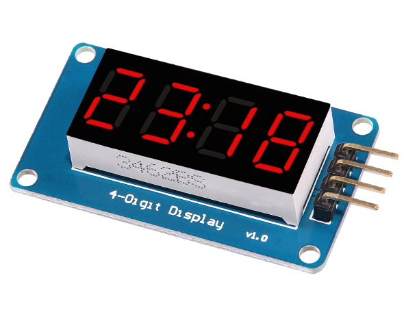

# TM1637 Library
This is tinyAVR (ATtiny13, ATtiny25, ATtiny45, ATtiny85) library for 7-segment display modules based on TM1637 chip. The TM1637 chip also has keyboard input capability, but it's not implemented in this library.



Modules based on TM1637 provide two signal connections (CLK and DIO) and two power connections (VCC and GND). Signal pins can be connected to any pair of digital pins of the AVR chip. Signal pins configuration is defined at the top of library header file, where it can be modifed.

## Key Features
This lightweight library has the following features:
* display raw segments
* display digits
* display colon
* brightness control
* display on/off
* software I2C

## Example Code
This example code demonstrates basic usage of the library:

```c
#include <stdint.h>
#include <avr/io.h>
#include <util/delay.h>
#include "tm1637.h"

int
main(void)
{
	uint8_t n, k = 0;

	/* setup */
	TM1637_init(1/*enable*/, 5/*brightness*/);

	/* loop */
	while (1) {
		for (n = 0; n < TM1637_POSITION_MAX; ++n) {
			TM1637_display_digit(n, (k + n) % 0x10);
		}
		TM1637_display_colon(1);
		_delay_ms(200);
		TM1637_display_colon(0);
		_delay_ms(200);
		k++;
	}
}
```

## API Documentation (tm1637.h)

```c
/**
 * Initialize TM1637 display driver.
 * Clock pin (TM1637_CLK_PIN) and data pin (TM1637_DIO_PIN)
 * are defined at the top of this file.
 */
void TM1637_init(const uint8_t enable, const uint8_t brightness);

/**
 * Turn display on/off.
 * value: 1 - on, 0 - off
 */
void TM1637_enable(const uint8_t value);

/**
 * Set display brightness.
 * Min value: 0
 * Max value: 7
 */
void TM1637_set_brightness(const uint8_t value);

/**
 * Display raw segments at position (0x00..0x03)
 *
 *      bits:
 *        -- 0 --
 *       |       |
 *       5       1
 *       |       |
 *        -- 6 --
 *       |       |
 *       4       2
 *       |       |
 *        -- 3 --
 *
 * Example segment configurations:
 * - for character 'H', segments=0b01110110
 * - for character '-', segments=0b01000000
 * - etc.
 */
void TM1637_display_segments(const uint8_t position, const uint8_t segments);

/**
 * Display digit ('0'..'9') at position (0x00..0x03)
 */
void TM1637_display_digit(const uint8_t position, const uint8_t digit);

/**
 * Display colon on/off.
 * value: 1 - on, 0 - off
 */
void TM1637_display_colon(const uint8_t value);

/**
 * Clear all segments (including colon).
 */
void TM1637_clear(void);

```
